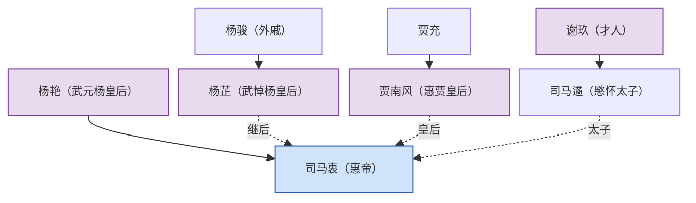
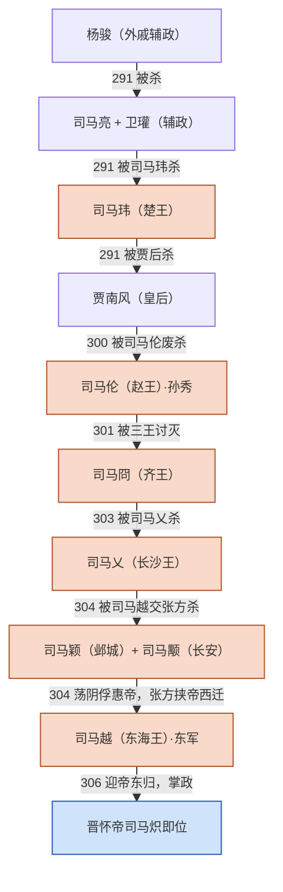

# 八王之乱人物关系

本文从 [[wiki/analyses/八王之乱：制度失控与西晋崩解|《八王之乱：制度失控与西晋崩解》]] 中抽出的人物关系图，独立成篇。下图用 Mermaid 绘制，在 Obsidian 中直接渲染。橙色为八王，蓝色为皇帝，紫色为后妃，虚线为婚姻关系。世系依据[[wiki/sources/晋书-宗室后妃世系摘录|《晋书》卷37、38、31世系摘录]]。

## 一、司马氏世系（血缘关系）

```mermaid
%%{init: {"flowchart": {"nodeSpacing": 10, "rankSpacing": 14}, "themeVariables": {"fontSize": "11px"}}}%%
graph TD
    YIDI["司马懿（宣帝）"]
    FU["司马孚（懿次弟）"]
    KUI["司马馗（懿弟）"]

    YIDI --> SHI["司马师（景帝，无子）"]
    YIDI --> ZHAO["司马昭（文帝）"]
    YIDI --> GAN["司马幹（平原王）"]
    YIDI --> LIANG["司马亮（汝南王）·第四子"]
    YIDI --> ZHOU["司马伷（琅邪王）"]
    YIDI --> JING["司马京（清惠亭侯）"]
    YIDI --> JUN["司马骏（扶风王）"]
    YIDI --> RONG["司马肜（梁王）"]
    YIDI --> LUN["司马伦（赵王）·第九子"]

    FU --> GUI["司马瑰（太原烈王）"]
    GUI --> YONG["司马颙（河间王）"]

    KUI --> TAI["司马泰（高密王）"]
    TAI --> YUE["司马越（东海王）"]
    KUI --> SUI["司马绥（范阳王）"]
    SUI --> XIAO["司马虓（范阳王）"]

    ZHAO --> YAN["司马炎（武帝）"]
    ZHAO --> YOU["司马攸（齐献王）"]

    YAN --> ZHONG["司马衷（惠帝）"]
    YAN --> WEI["司马玮（楚王）·第五子"]
    YAN --> YI["司马乂（长沙王）·第六子"]
    YAN --> YING["司马颖（成都王）"]
    YAN --> YUN["司马允（淮南王）"]
    YAN --> CHI["司马炽（怀帝）"]

    YOU --> JIONG["司马冏（齐王）"]

    ZHOU --> JINWANG["司马觐（琅邪恭王）"]
    JINWANG --> RUI["司马睿（元帝，东晋）"]

    classDef emperor fill:#cfe3fb,stroke:#2a5db3
    classDef bawang fill:#f9d9c9,stroke:#b3552a
    class YAN,ZHONG,CHI,RUI emperor
    class LIANG,LUN,YONG,YUE,WEI,YI,YING,JIONG bawang
```

要点：

- 八王分属四支：[[wiki/entities/司马亮|司马亮]]、[[wiki/entities/司马伦|司马伦]]是司马懿之子；[[wiki/entities/司马玮|司马玮]]、[[wiki/entities/司马乂|司马乂]]、[[wiki/entities/司马颖|司马颖]]是武帝之子；[[wiki/entities/司马冏|司马冏]]是司马昭—司马攸一脉；[[wiki/entities/司马颙|司马颙]]、[[wiki/entities/司马越|司马越]]分属司马孚、司马馗两支。
- 司马师无子，以司马昭之子司马攸为嗣，故司马冏宗法上兼承景帝、文帝两脉。
- 图中司马虓、司马允、司马肜、司马骏之子司马歆等为参与乱事的其他宗王；元帝司马睿出自琅邪王司马伷一脉，是八王之乱后东晋南渡的线索。

### 八王按亲缘关系分类

以惠帝司马衷为基准，八王恰好分布在**三个世代**上，结构为 **2／2／4**：

| 世代 | 王 | 支脉路径 | 与惠帝关系 |
| --- | --- | --- | --- |
| 祖辈 | [[wiki/entities/司马亮|司马亮]] | 懿→亮（第四子） | 叔祖 |
| 祖辈 | [[wiki/entities/司马伦|司马伦]] | 懿→伦（第九子） | 叔祖 |
| 父辈 | [[wiki/entities/司马颙|司马颙]] | 孚→瑰→颙 | 族伯（懿次弟孚之孙） |
| 父辈 | [[wiki/entities/司马越|司马越]] | 馗→泰→越 | 族叔伯（懿弟馗之孙） |
| 同辈 | [[wiki/entities/司马冏|司马冏]] | 昭→攸→冏 | 堂弟／再从弟 |
| 同辈 | [[wiki/entities/司马玮|司马玮]] | 炎→玮（第五子） | 异母弟 |
| 同辈 | [[wiki/entities/司马乂|司马乂]] | 炎→乂（第六子） | 异母弟 |
| 同辈 | [[wiki/entities/司马颖|司马颖]] | 炎→颖 | 异母弟 |

按离皇统的远近，可分两半：

- **司马昭一系内（4人）**：司马玮、司马乂、司马颖（武帝之子）＋司马冏（司马攸之子）。
- **司马昭一系外（4人）**：司马亮、司马伦（司马懿本人之子）＋司马颙、司马越（司马懿之弟孚、馗的孙辈）。

八王恰有一半出自文帝司马昭血统之外。祖辈靠“资格老”、父辈靠“地方军力”、同辈靠“血缘近”，三种合法性来源互不承认，这是单一继承规则无法平息冲突的结构性原因（依据见[[wiki/sources/晋书-宗室后妃世系摘录|《晋书》世系摘录]]“使用提示”）。

> **分析判断：** 血缘最近的武帝三子（玮、乂、颖）全部死于非命且无一最终掌政，而最终掌政的司马越是血缘最疏的旁支（懿弟馗之孙）——疏远反而无继承威胁，容易被各方接受为“盟主”。史料未如此表述，属综合分析。

## 二、外戚与后妃世系

要点：

- 惠帝是两代外戚争权的中心：杨骏以外戚辅政，其女杨芷为武帝继后；贾南风为惠帝皇后，其父贾充是开国元老。
- 杨艳（元后）生惠帝；杨芷（悼后）是杨艳从妹、杨骏之女，二人分属杨家不同世代。
- 司马遹为谢玖所生，非贾南风之子，这是贾后废杀太子的关键背景。

## 三、权力更替与结局（谁消灭了谁）

要点：

- 从杨骏到司马越，每轮掌权者都由下一轮的胜利者消灭，边缘箭头标明了执行者。例外是[[wiki/entities/司马越|司马越]]：他自己没有死于八王战争，而是311年出征汉赵途中病死。
- 司马颖与司马颙在304—306年结成邺城—长安同盟，但二者并不稳定：荡阴之战后惠帝先被司马颖俘虏，又被司马颙部将张方挟持西迁，皇帝名义在两者之间流转。
- 图中省略了不在权力主轴上的关键辅助人物，其角色见下。

## 四、非司马氏关键人物

| 人物 | 身份 | 在乱局中的作用 |
| --- | --- | --- |
| 司马遹 | 晋惠帝太子 | 谢玖所生，被贾南风废杀，其死成为司马伦篡位的借口 |
| 杨骏 | 外戚，杨芷之父 | 武帝死后辅政，291年被贾后联合宗室诛杀 |
| 杨芷 | 武悼杨皇后 | 杨骏之女，被贾后诬为同逆，废为庶人，292年死于金墉城 |
| 贾南风 | 惠贾皇后 | 贾充之女，废杀太子、操控宫廷，300年被司马伦废杀 |
| 卫瓘 | 元老大臣 | 与司马亮共同辅政，被司马玮所杀 |
| 孙秀 | 司马伦亲信 | 策划借太子之死废贾后、助司马伦篡位 |
| 张华 | 朝中重臣 | 贾后掌权期间维持朝局，司马伦政变时被杀 |
| 张方 | 司马颙部将 | 攻洛阳、杀司马乂、挟惠帝西迁长安 |
| 王浚 | 幽州都督 | 联合鲜卑、乌桓攻邺，逼司马颖出逃 |
| 刘渊 | 匈奴五部首领 | 借八王乱局起兵，建立汉赵，最终攻灭西晋 |

## 世系考订

- 司马亮排行：[[wiki/sources/晋书-宗室后妃世系摘录|《晋书》卷三十八]]以母系分组，司马亮为伏夫人所生、列第四位；卷五十九亦作“宣帝第四子”。维基百科条目作“第三子”，系误，本文从《晋书》。
- 司马颙为司马孚之孙（孚→太原烈王瑰→颙）；司马越为司马馗之孙（馗→高密文献王泰→越）。
- 司马冏为齐献王司马攸之子；攸过继给景帝司马师，故司马冏兼承两脉。
- 成都王司马颖为武帝之子，其具体排位在《晋书》卷五十九成都王颖传，本文未据二手资料妄断，图中仅标“武帝之子”。

## 相关页面

- [[wiki/analyses/八王之乱：制度失控与西晋崩解|八王之乱：制度失控与西晋崩解]]
- [[wiki/concepts/八王之乱|八王之乱]]
- [[wiki/sources/晋书-宗室后妃世系摘录|《晋书》宗室与后妃世系摘录]]
